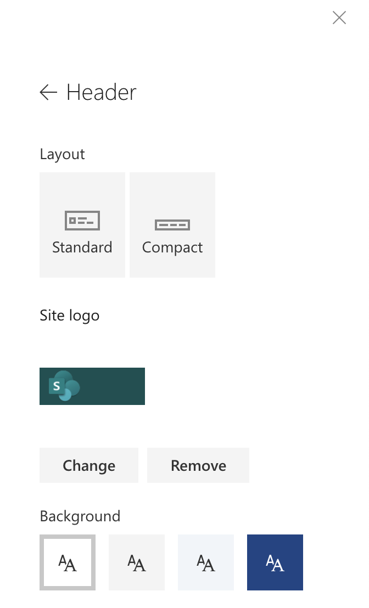

Have you ever wondered where the background colors in SharePoint modern pages comes from? You know, the ones for section background colors and site headers? Have you ever wondered how to change them to your own custom colors?



I had a client that wanted to be able to set the background for the site headers to a specific color. Unfortunately, the color they wanted wasn't one of the four colors available through the SharePoint UI.

It turns out not unexpectedly that these colors are controlled by the theme being used on the site. To create a set of custom colors you need to create a custom theme. You can do that using the [UI Fabric Theme Designer](https://fabricweb.z5.web.core.windows.net/pr-deploy-site/refs/pull/9318/merge/theming-designer/index.html). Once you have a custom theme created you deploy it to your tenant. The Theme Designer provides you with JSON or PowerShell for you to deploy the theme to your site. The PowerShell or JSON has tokens in it for the different colors and hex values assigned to each. Here is an example of the tokens provided by the Theme Designer.

```powershell
"themePrimary" = "#0078d4";
"themeLighterAlt" = "#f3f9fd";
"themeLighter" = "#d0e7f8";
"themeLight" = "#a9d3f2";
```

The color used for the four background colors across SharePoint are from left to right:

- white
- neutralLighter
- themeLighterAl
- themePrimary


Depending on the colors you set these values to they will update the background colors available to you in the SharePoint UI.

The Theme Designer sets most of the colors to provide a sufficient amount of contrast in the color when using a light background and darker text or vice versa so I would not recommend changing these willy nilly but you do have the ability to tweak colors if they don't exactly match your brand's color palette. Here is some PowerShell to deploy the theme to your tenant.

```powershell
#SharePoint admin site url
$adminSiteUrl = "https://myTenant-admin.sharepoint.com"
$themeName = "My Custom Theme"
#ask user for credentials. User needs SharePoint Admin rights
$credentials = Get-Credential

#connect to SPO
Connect-SPOService $adminSiteUrl -Credential $credentials

#Replace the variable value with the generated code
$theme = @{
     "themePrimary" = "#0078d4"; #Fourth Background Color
     "themeLighterAlt" = "#f3f9fd"; #Third Background Color
     "themeLighter" = "#d0e7f8";
     "themeLight" = "#a9d3f2";
     "themeTertiary" = "#5ca9e5";
     "themeSecondary" = "#1a86d9";
     "themeDarkAlt" = "#006cbe";
     "themeDark" = "#005ba1";
     "themeDarker" = "#004377";
     "neutralLighterAlt" = "#f8f8f8";
     "neutralLighter" = "#f4f4f4"; #Second Background Color
     "neutralLight" = "#eaeaea";
     "neutralQuaternaryAlt" = "#dadada";
     "neutralQuaternary" = "#d0d0d0";
     "neutralTertiaryAlt" = "#c8c8c8";
     "neutralTertiary" = "#bab8b7";
     "neutralSecondary" = "#a3a2a0";
     "neutralPrimaryAlt" = "#8d8b8a";
     "neutralPrimary" = "#323130";
     "neutralDark" = "#605e5d";
     "black" = "#494847";
     "white" = "#ffffff"; #First Background Color
}

#I ran into a few issues with theme updating using the -overwrite
#command so removing it and re-adding it

Remove-SPOTheme -name $themeName
Add-SPOTheme -Name $themeName -Palette $theme -IsInverted:$false 


```

After you deploy the theme it will be available across all SharePoint Online sites for use. You will need to apply the theme to your specific site in order for it to use these colors either manually through the UI or through PowerShell.

One note of caution, the family of tokens are designed to work as a unit so changing one value may have unintended consequences. For example changing themeLighterAlt to a dark color instead of a light color will result in dark text on a dark background which is bad for readability and accessibility.
