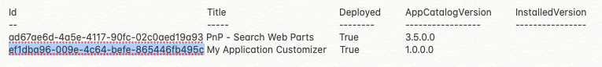

Sometimes things are harder than they need to be. I have been working on Site Designs recently to automate the creation and deployment of different element in a site. For the most part things were pretty straight forward for what I needed to do, add a theme to a site, add site columns, and add content types. This time around I needed to deploy an SPFx Application Customizer that needed to be installed on individual sites. The [official documentation](https://docs.microsoft.com/en-us/sharepoint/dev/declarative-customization/site-design-json-schema#register-an-extension) on this is a little lacking. It doesn't really explain what you need to do in order to make it work. I also looked at the [PnP Site Design Samples](https://github.com/SharePoint/sp-dev-site-scripts/tree/master/samples/site-register-spfx-extension) which got me a little closer. It took me quite a while to figure out the right magic voodoo combination that got it to work.

First, deploy the App Customizer to the app catalog as normal.

Next, once the app is loaded use PowerShell to run Get-PnPApp. This will return a list of the apps that are available in the app catalog. Look for something like this.  


For your Site Design you need the following verbs  

```
{
  "$schema": "schema.json",
  "actions": [
    {
      "verb": "installSolution",
      "id": "ef1dba96-009e-4c64-befe-865446fb495c"
  },
  {
      "verb": "associateExtension",
      "title": "SPFXApplicationCustomizer Example",
      "location": "ClientSideExtension.ApplicationCustomizer",
      "clientSideComponentId": "29399991-914b-494b-a110-e9f866008426",
      "scope": "Web"
  }
  ],
  "bindata": { },
  "version": 1
}
```

There are some really important things to note here. Under installSolution the id is the GUID that was listed in Get-PnPApp. Under the associateExtention verb the Title is what is shown in the UI. clientSideComponentId is the id you find in the manifest file for your customizer. MyApplicationCustomizer.manifest.json.

```
{
  "$schema": "https://developer.microsoft.com/json-schemas/spfx/client-side-extension-manifest.schema.json",

  "id": "29399991-914b-494b-a110-e9f866008426",
  "alias": "MyApplicationCustomizer",
  "componentType": "Extension",
  "extensionType": "ApplicationCustomizer",

  // The "*" signifies that the version should be taken from the package.json
  "version": "*",
  "manifestVersion": 2,

  // If true, the component can only be installed on sites where Custom Script is allowed.
  // Components that allow authors to embed arbitrary script code should set this to true.
  // https://support.office.com/en-us/article/Turn-scripting-capabilities-on-or-off-1f2c515f-5d7e-448a-9fd7-835da935584f
  "requiresCustomScript": false
}

```

Now that the right GUIDS are in the right place it's time to deploy the code. For clarity here I blocked it off into three distinct components.

### Add the Site Script

```powershell
$adminUrl = "https://mytenant-admin.sharepoint.com"
$title = "The Site Script"
$scriptFile = "my-Site-Script.json"

$username = "adminuser@mytenant.com"
$password = "12345"
$securepassword = $password | ConvertTo-SecureString -AsPlainText -Force
$Credentials = New-Object System.Management.Automation.PSCredential -ArgumentList $username, $securepassword

Connect-SPOService $adminUrl -Credential $Credentials

$fileContents = Get-Content $scriptFile -Raw
Add-SPOSiteScript -Title $title -Content $fileContents | Select -First 1 Id 

```

This adds the site script to the tenant. Next you need the GUID for the site script. You could do all this in one function using PowerShell but to make things linear here it is. Using PowerShell run Get-SPOSiteScript. You will get a list of site scripts that are installed. Copy the GUID of the one you just installed.

### Install the Site Design and Add the Script to it

```powershell
$adminUrl = "https://mytenant-admin.sharepoint.com"
$siteDesignTitle = "My Site Design"
$desc = "Site design that provisions a communications site"
$webTemp = "68"
#68 is for Communications Sites 64 is for Team Sites

$username = "adminuser@mytenant.com"
$password = "12345"
$securepassword = $password | ConvertTo-SecureString -AsPlainText -Force
$Credentials = New-Object System.Management.Automation.PSCredential -ArgumentList $username, $securepassword


Connect-SPOService $adminUrl -Credential $Credentials

Add-SPOSiteDesign -SiteScripts MyGUID -Title $siteDesignTitle -WebTemplate $webTemp -Description $desc

```

This creates a new site design and adds the site script to it. After this is complete you should now be able to see the Site Script in the UI both in the SharePoint Admin Center and in the site as well.

### Updating Site Script

In the event you need to update your site script make sure that you only update the script and not the site design.

```powershell
$adminUrl = "https://mytenant-admin.sharepoint.com"
$scriptFile = "my-Site-Script.json"

$username = "adminuser@mytenant.com"
$password = "12345"
$securepassword = $password | ConvertTo-SecureString -AsPlainText -Force
$Credentials = New-Object System.Management.Automation.PSCredential -ArgumentList $username, $securepassword

Connect-SPOService $adminUrl -Credential $Credentials

Set-PnPSiteScript -Identity MyGUID -Content (Get-Content $scriptFile -Raw)
```

While I was trying to get this working I did manage to mess things up quite a bit. Having any extra artifacts lying around caused things to fail so I made sure that I checked **Get-PnPCustomAction** to ensure that before I deployed the action wasn't there. I also made sure with **Get-SPOSiteScript** and **Get-SPOSiteDesign** that my site design and scripts were not already there. In the end I tore everything out including the app customizer and started over but just removing the app doesn't remove the site design.

Site Designs are a powerful tool to help us automate some of our configuration steps and being able to connect it to an SPFx web part or app customizer expands that power. I hope that this helps anyone else who is struggling to get this to work.
