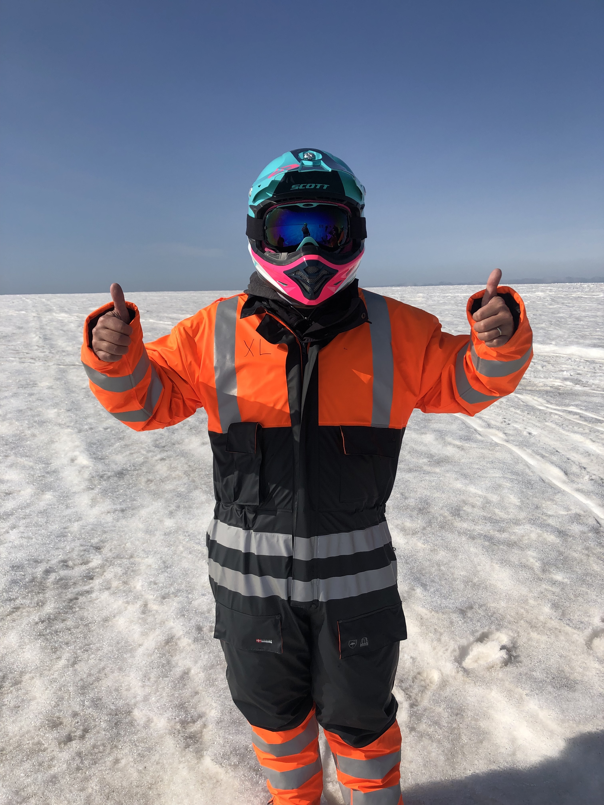

This is a departure from your regularly scheduled programming of technical/SharePoint content. We originally published this on the [Sympraxis newsletter](https://sympraxisconsulting.com/2019/08/07/newsletter-8-6-2019/).

Last summer I went on an impromptu vacation with my husband to Iceland. Despite having a whirlwind tour we left the weekend more invigorated and relaxed than we had been in a long time. On the plane ride home, we found ourselves talking about how amazing we found the island and how much we wanted to travel more with our son and show him the incredible places around the world. Inevitably the “nevers” and “don’ts” “and can’t” reared their ugly heads into the conversation.

_“We don’t have enough money.”  
“We don’t have enough vacation time.”  
“It’s impractical.”  
“It’s crazy!”_ 

…and all the other obligations and reasons we all throw up in front of ourselves. We were feeling sad and defeated. But given the weekend we had just come from, and the impression left on us by the experience, it hit us that these were all social constructs that we were imposing on ourselves. We looked at each other and stopped saying we can’t, and we don’t, and started saying “Why not? and “We can!” Jobs can change, vacation time can change, people can adapt and grow. We set about making a plan and putting it out to the universe that we would change. We would do this.

Working from home has been a part of my professional career for the better part of the last 15 years. I would work from home several days a week and go into the office for the other two. Generally, that included either my couch or the Starbucks down the street. When I joined Sympraxis in January I made the jump to working remotely 100% of the time. This was the cornerstone in our master plan to move to Iceland for the summer with our child and experience another culture first hand. Shortly after my husband made a similar switch and we were free to build this adventure of life. The Monday after our son finished school for the year, we were on the plane touching down in Iceland for the entire summer. Our goal was to work but also to experience a different part of the world and share this experience with our son.

This has been an interesting exercise in work/life balance and self-discipline. Being half a day ahead of most of my colleagues and clients means that when I wake up, I have several hours of quiet time to focus on getting things done before my counterparts are awake. Conversely, it also means that when I am ready to wind my day down at 5pm and head to a local hotpot (geothermically heated pool) they are just coming back from lunch and ready to go.

It has been hard to not work all the time. I have found myself answering client emails at 7 or 8pm, which is something I never do when I am home, but it seems a little more normal here. One of my current projects is working with an international team as well so it means I could be having meetings at 8am with Tokyo and 6pm meetings with Boston so it can make for a very long day.

This was a big shift for me, I am so used to working in the same time zone as my clients but for the most part we have managed the time differences. The other issue has come around both of us working across from each other at the dining room table instead of at home in our office spaces which inevitably has led to some overlapping conference calls and lots of mute/unmute of the headsets.

We have also made it a priority to carve out time for us to experience this amazing country. Part of the beauty of being in a different location is making sure that we actually see it and experience it and to not buried in our laptops the entire time. During the week we try to clock out at a reasonable time and then experience the city culture of Reykjavik, like going to the city swimming pools/hot tubs, walking around the city, or going for ice cream. On the weekends we have been renting a car and exploring the country with day or weekend trips. We have been able to scream into raging waterfalls, stand on a glacier, and touch ancient ice in an ice cave.

What this has all brought home for me is that I spent too many years taking life too seriously. I am very lucky to have the opportunities that I have. But at the end of the day, life is short, and it might all be gone tomorrow. When I think about getting old, I want to sit back with my husband and say, “remember that time I tripped and almost fell to my death at the waterfall? That was pretty stupid.” I want my son to remember that summer or summers he spent experiencing how other kids live and learning what it feels like to not always understand the language. I hope that he takes away a broader appreciation for the world and where he sits as part of it.

<figure>

<figcaption>

Riding a snow mobile on a glacier

</figcaption>

</figure>

We are already planning where we will spend next summer. Right now, the top contenders are Portugal, Denmark, and Greece. This is just a reminder that in this global economy with remote work being very common that just because you work from “home” it doesn’t need to be your permanent address. Get up, grab your laptop, and experience the world even if that is the Starbucks down the street, the next state over, or an island in the north Atlantic.
