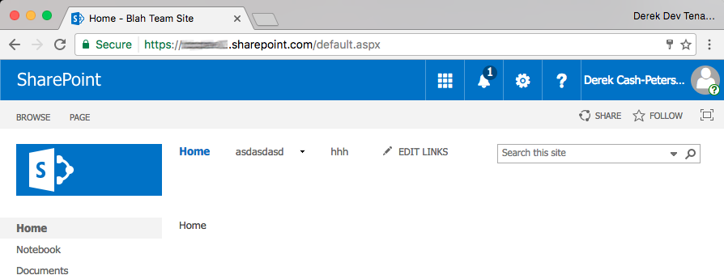

A friend of a friend of a friend told about this thing that totally changed their life. It wasn't exactly that convoluted but I was complaining to a friend the other day about constantly having to switch credentials for my office 365 tenants. He suggested a nifty trick that a friend of ours [Beatrice Baciu](http://thebookofsharepoint.blogspot.com/) wrote about. He showed me how to use Chrome Personas to manage my different office 365 accounts.

If you are like me you have many different office 365 accounts. I have two to access my company information like my intranet and staffing tool. I have two different developer tenants and a few client tenants that I need to keep track of. Chrome has the ability to create different personas. When I actually tried this it changed the way I manage my accounts. I did a little happy dance.

- Open Chrome
- In the top right corner you will see either Guest of your name if you are signed in using your google account. Click that and it will bring down a drop down.  
    
- The top name is the persona that you are currently signed in as, the bottom list are the personas that you can choose from.
- Click Manage People  
    
- Click Add Person
- Enter a name for the persona, select an avatar, and click save. This adds a new persona to chrome and will open a new Chrome instance for that persona.  
      
    
- Look in the top right. The persona is now changed to my new persona. I can now log into my dev tenant.  
    
- When you log in to your Office 365 account make sure you check the keep me signed in check box so your authentication persists.
- I can then open a new Chrome window, switch to a different persona and have two windows open at the same time with different office 365 accounts!!!

I hope this is helpful to someone other than me. I mentioned this to several of the folks that work with me and they couldn't believe they hadn't heard about this before so I figured I would get it out there in an effort to make others lives a little better. :)

Enjoy! - d
