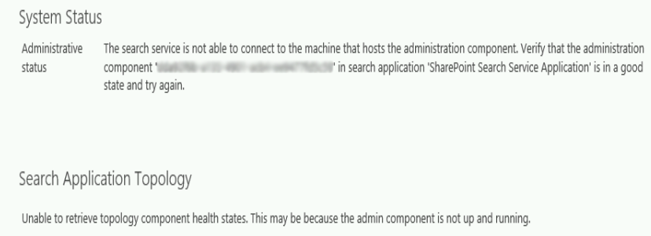
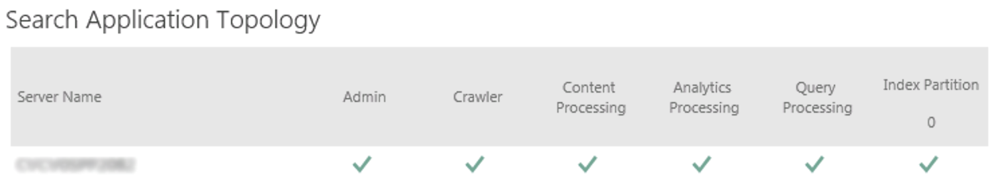

The other night I burned way too many hours trying to fix a broken search service application for what seemed like a ridiculous reason. We have an integration server that we are using for a large project. I was working with it earlier in the day testing some front end code. Later in the evening with no apparent cause it decided to throw the error below on the Search Administration screen. This prevented search from operating and all my client side queries returned a nondescript 500 error telling me to check my search service.

_**"The search service is not able to connect to the machine that hosts the administration component"**_



After many hours of research it turns out that this error happens fairly often for many different reasons. Essentially the search administration component of the Search Topology gets corrupted. No real reason why, it just happens.

Search if you don't already know is made up of a bunch of different components. Each component serves a different purpose from administration of the search service to crawling, to indexing the content. Each one of these components is held together as a collection in what is called a Search Topology object. There can be multiple search topologies in the search application but only one active topology. 



When you create your search service application all these component are created for you automatically. In our instance we used SPAutoInstaller to build the box so it provisioned the services using PowerShell. Our search administration became corrupted and search would no longer run or return results.  

There are a lot of fixes out there that reference changing the app pool in IIS that the search service is running in. Not only did this not fix our issue it also seemed very wrong that something that was previously running would suddenly stop running because of the app pool unless the app pool stopped. I also tried elevating the permissions of the app pool account for the account that the service was running in which seemed equally as incorrect. Neither of these solutions resolved our issue. 

I decided to investigate the Search Topology using PowerShell. I could very clearly see the default topology and the components via PowerShell and see the broken component. 

```
$ssa = Get-SPEnterpriseSearchServiceApplication
$topology = Get-SPEnterpriseSearchTopology -SearchApplication $ssa
Get-SPEnterpriseSearchComponent -SearchTopology $topology.Id -SearchApplication $ssa
```

Finally, I tried to delete the search service application and recreate it through the UI. The search application removed cleanly and I was able to create a new one from the UI with no issues. I checked the search topology again and it was identical to the previous topology with the corrupted administration component. The default topology was saved somewhere in the SharePoint database. 

Ok, I thought if the search topology is the same then I will use PowerShell and create a new topology as a clone from the last one, delete the corrupted component, and assign the new topology to the search application. No Dice! It turns out that while I could create a new topology I was unable to assign it to the search application because the existing default topology wasn't working. I was getting ready to revert the server to a snapshot that was old and recreate all the work I had done.

Finally, in a Hail Mary pass, I decided to recreate the Search Service Application using PowerShell. So, I deleted the broken Search Service Application through the UI. Then I went to the database server to ensure that the databases were deleted. I restarted the search services (SharePoint Search Host Controller and SharePoint Server Search 15 from the Services console). I took a deep breath, crossed my fingers, and recreated the Search Service Application using a PowerShell script I modified from [Todd Klindt](https://www.toddklindt.com/blog/Lists/Posts/Post.aspx?ID=378). This fixed the issue. Now I have a happy search service and a PowerShell script to fix the issue the next time it happens. 

Update - 12/11/18  
Ian Dicker reminded me that I am a typical developer. Given that I am working on such a search intensive application I should have probably been backing up my search application regularly. I am a developer at heart and love the excitement of flying by the seat of my pants but he is correct. Had there been a backup this would have been a lot quicker. If you are looking for information on how to back up the search application. Look no further than [MSDN](https://docs.microsoft.com/en-us/sharepoint/administration/back-up-a-search-service-application).
